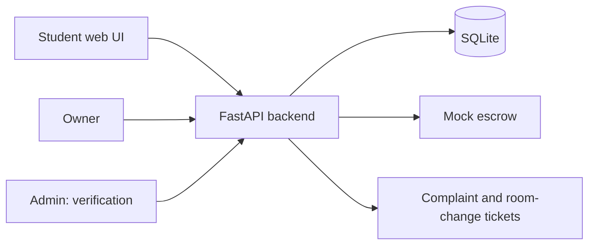

# Architecture

## Components
- **index.html**: single-page student UI (search, book, report).
- **app.py**: REST API for listings, verification, comparison, bookings, complaints, reviews.
- **SQLite**: tables `properties`, `bookings`, `complaints`, `reviews`.
- **Mock escrow**: booking sets escrow `HELD`; release sets `RELEASED`. No real money moves.
- **Admin verification**: protected by the `X-Admin-Key` header (mock KYC).
- **Safety flow**: a `safety` complaint gets a target room-change date 3 days out (a service target, subject to availability).

## Production roadmap
Real KYC (Aadhaar/DigiLocker), a regulated payment gateway with escrow, auth (JWT), a Postgres database, reviews tied to completed stays, and a mobile app.
